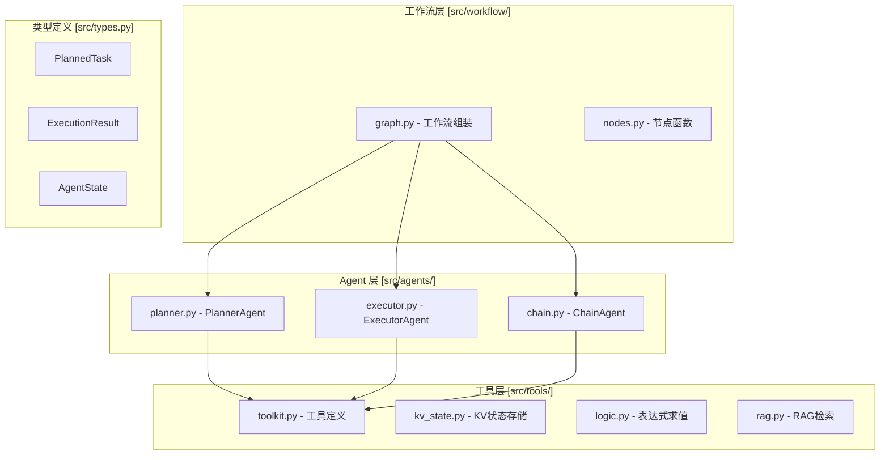

# TRPG 项目改进方案

## 项目现状分析

### 架构概览



### 现有问题识别

| 类别 | 问题描述 | 影响 |
|------|----------|------|
| 代码重复 | 三个 Agent 都有相似的 ReAct 循环、工具调用逻辑 | 维护困难，新增 Agent 成本高 |
| 配置分散 | API Key、模型名称等分散在各处 | 难以管理，容易出错 |
| 错误处理 | 解析失败时使用 fallback，但没有重试机制 | 可能产生错误结果 |
| 日志 | 使用 print 输出，无结构化日志 | 难以调试和监控 |
| 工具设计 | GetStateTool 和 ReadTool 功能重叠 | 工具职责不清晰 |

---

## 改进方案

### 1. 提取 Agent 基类

**目标**：消除三个 Agent 之间的代码重复

**设计**：

```python
# src/agents/base.py
from abc import ABC, abstractmethod
from langchain_core.messages import SystemMessage, HumanMessage, AIMessage, ToolMessage

class BaseAgent(ABC):
    """Agent 基类 - 封装 ReAct 循环和工具调用逻辑"""

    def __init__(self, model: str, api_key: str | None, base_url: str | None, tools: list):
        self.tools = {t.name: t for t in (tools or [])}
        self.llm = self._create_llm(model, api_key, base_url)
        self.llm_with_tools = self.llm.bind_tools(tools) if tools else self.llm

    def _create_llm(self, model: str, api_key: str | None, base_url: str | None):
        kwargs = {"model": model, "temperature": 0, "api_key": api_key}
        if base_url:
            kwargs["base_url"] = base_url
        return ChatOpenAI(**kwargs)

    def _react_loop(
        self,
        messages: list,
        max_iterations: int = 10,
        force_output_prompt: str = "请直接输出结果"
    ) -> AIMessage:
        """执行 ReAct 循环，返回最终的 AI 消息"""
        for i in range(max_iterations):
            response = self.llm_with_tools.invoke(messages)
            messages.append(response)

            if not response.tool_calls:
                break

            for tool_call in response.tool_calls:
                result = self._execute_tool(tool_call)
                messages.append(ToolMessage(content=str(result), tool_call_id=tool_call["id"]))

        # 强制输出处理
        if self._should_force_output(i, max_iterations, response):
            messages.append(HumanMessage(content=force_output_prompt))
            response = self.llm_with_tools.invoke(messages)
            messages.append(response)

        return self._extract_final_message(messages)

    def _execute_tool(self, tool_call: dict) -> str:
        """执行单个工具调用"""
        tool_name = tool_call["name"]
        tool_args = tool_call["args"]

        if tool_name in self.tools:
            try:
                result = self.tools[tool_name].invoke(tool_args)
                # 截断过长结果
                if len(str(result)) > 2000:
                    result = str(result)[:2000] + "\n... [截断]"
                return result
            except Exception as e:
                return f"错误: {e}"
        return f"错误: 未知工具 {tool_name}"

    @abstractmethod
    def _should_force_output(self, iteration: int, max_iterations: int, response) -> bool:
        """子类决定是否强制输出"""
        pass

    @abstractmethod
    def _extract_final_message(self, messages: list) -> AIMessage:
        """子类提取最终消息"""
        pass
```

**改造后**：

```python
# src/agents/planner.py
class PlannerAgent(BaseAgent):
    SYSTEM_PROMPT = "..."

    def plan(self, user_input: str) -> PlannedTask:
        messages = [
            SystemMessage(content=self.SYSTEM_PROMPT),
            HumanMessage(content=f"DM指令: {user_input}")
        ]
        final_message = self._react_loop(messages, max_iterations=10)
        return self._parse_planned_task(final_message.content, user_input)

    def _should_force_output(self, iteration, max_iterations, response):
        return iteration >= max_iterations - 1

    def _extract_final_message(self, messages):
        # 提取逻辑...
        pass
```

---

### 2. 统一配置管理

**目标**：集中管理所有配置项

**设计**：

```python
# src/config.py
from dataclasses import dataclass
from typing import Optional
import os

@dataclass(frozen=True)
class AppConfig:
    """应用配置"""
    # LLM 配置
    llm_model: str = "gpt-4o"
    llm_api_key: Optional[str] = None
    llm_base_url: Optional[str] = None

    # RAG 配置
    qdrant_url: str = "http://localhost:6333"
    qdrant_collection: str = "dnd_5e_srd_hybrid"
    embedding_model: str = "BAAI/bge-m3"
    rerank_model: str = "BAAI/bge-reranker-v2-m3"
    siliconflow_api_key: Optional[str] = None

    # 状态存储
    world_state_path: str = "data/world_state.txt"
    persist_state: bool = False

    # 执行参数
    max_react_iterations: int = 10
    enable_dm_confirm: bool = True

    @classmethod
    def from_env(cls) -> "AppConfig":
        """从环境变量加载配置"""
        return cls(
            llm_model=os.getenv("LLM_MODEL", "gpt-4o"),
            llm_api_key=os.getenv("DEEPSEEK_API_KEY") or os.getenv("OPENAI_API_KEY"),
            llm_base_url=os.getenv("DEEPSEEK_BASE_URL"),
            siliconflow_api_key=os.getenv("SILICONFLOW_API_KEY"),
            persist_state=os.getenv("PERSIST_STATE", "false").lower() == "true",
        )
```

**使用方式**：

```python
from src.config import AppConfig

config = AppConfig.from_env()

# 创建工作流
workflow, store = create_workflow(config)
```

---

### 3. 完善错误处理

**目标**：增加重试、降级和更清晰的错误信息

**设计**：

```python
# src/utils/retry.py
from functools import wraps
from typing import TypeVar, Callable
import time

T = TypeVar('T')

def retry(
    max_attempts: int = 3,
    delay: float = 1.0,
    exceptions: tuple = (Exception,)
) -> Callable[[Callable[..., T]], Callable[..., T]]:
    """重试装饰器"""
    def decorator(func: Callable[..., T]) -> Callable[..., T]:
        @wraps(func)
        def wrapper(*args, **kwargs) -> T:
            last_exception = None
            for attempt in range(max_attempts):
                try:
                    return func(*args, **kwargs)
                except exceptions as e:
                    last_exception = e
                    if attempt < max_attempts - 1:
                        time.sleep(delay * (attempt + 1))
            raise last_exception
        return wrapper
    return decorator


# src/agents/exceptions.py
class AgentError(Exception):
    """Agent 基础异常"""
    pass

class ParseError(AgentError):
    """解析失败"""
    def __init__(self, content: str, reason: str):
        self.content = content
        self.reason = reason
        super().__init__(f"解析失败: {reason}")

class ToolExecutionError(AgentError):
    """工具执行失败"""
    pass


# src/agents/planner.py 改造后
def _parse_planned_task_natural(self, content: str, original_input: str) -> PlannedTask:
    try:
        # 原有解析逻辑...
        pass
    except Exception as e:
        # 记录详细错误信息
        logger.error(f"解析失败: {e}", extra={"content": content[:500]})
        # 返回 fallback，但标记为需要确认
        return PlannedTask(
            task_id=f"task_{uuid.uuid4().hex[:8]}",
            natural_description=original_input,
            actor="未知",
            context={"raw_description": content, "parse_error": str(e)},
            source="dm",
            requires_confirmation=True  # 新增字段
        )
```

---

### 4. 引入结构化日志

**目标**：使用 structlog 替代 print，支持结构化输出

**设计**：

```python
# src/utils/logging.py
import structlog
import logging
import sys

def configure_logging(debug: bool = False):
    """配置结构化日志"""
    structlog.configure(
        processors=[
            structlog.stdlib.filter_by_level,
            structlog.stdlib.add_logger_name,
            structlog.stdlib.add_log_level,
            structlog.stdlib.PositionalArgumentsFormatter(),
            structlog.processors.TimeStamper(fmt="iso"),
            structlog.processors.StackInfoRenderer(),
            structlog.processors.format_exc_info,
            structlog.processors.UnicodeDecoder(),
            structlog.processors.JSONRenderer() if not debug else structlog.dev.ConsoleRenderer()
        ],
        context_class=dict,
        logger_factory=structlog.stdlib.LoggerFactory(),
        wrapper_class=structlog.stdlib.BoundLogger,
        cache_logger_on_first_use=True,
    )

    logging.basicConfig(
        format="%(message)s",
        stream=sys.stdout,
        level=logging.DEBUG if debug else logging.INFO,
    )


# 使用示例
import structlog

logger = structlog.get_logger(__name__)

# 替换原有的 print
logger.info("生成任务", task_id=task.task_id, description=task.natural_description)
logger.error("解析失败", content=content[:200], error=str(e))
```

---

### 5. 优化工具设计

**目标**：合并重复工具，简化工具集

**现状问题**：
- `GetStateTool` 和 `ReadTool` 功能重叠
- `PatchStateTool` 和 `WriteTool` 功能重叠

**改进方案**：

```python
# 保留的工具列表：
# 1. fetch_keys - 获取所有 key
# 2. read - 读取指定 key（保留批量读取能力）
# 3. write - 写入状态（统一 PatchState 和 Write）
# 4. evaluate - 表达式求值
# 5. search - RAG 检索

# 删除：GetStateTool（read 可替代）、PatchStateTool（write 替代）
```

**工具描述优化**：

```python
class ReadTool(BaseTool):
    """读取状态工具 - 读取指定key(s)的KV记忆value"""
    name: str = "read"
    description: str = """
    读取指定key(s)的KV记忆value。

    使用场景：
    - 获取单个key: keys=["Aldera.combat"]
    - 批量获取: keys=["Aldera.combat", "Goblin.status"]
    - 获取所有: 先调用 fetch_keys，再用 read 批量获取
    """
```

---

### 6. 改进状态类型定义

**目标**：添加更多类型安全，明确字段含义

**改进**：

```python
# src/types.py
from typing import Literal, TypedDict, Annotated
from dataclasses import dataclass, field
from enum import Enum

class TaskSource(Enum):
    """任务来源"""
    DM = "dm"
    CHAIN = "chain"
    SYSTEM = "system"

class Operation(Enum):
    """状态变更操作"""
    ADD = "ADD"
    MOD = "MOD"
    DEL = "DEL"

@dataclass
class PlannedTask:
    """统一任务描述"""
    task_id: str
    natural_description: str
    actor: str | None = None
    target: str | None = None
    action: str = ""
    context: dict = field(default_factory=dict)
    source: TaskSource = TaskSource.DM
    requires_confirmation: bool = False  # 新增：是否需要DM确认
    priority: int = 0  # 新增：任务优先级

@dataclass
class StateChange:
    """状态变更记录"""
    path: str
    old_value: Any
    new_value: Any
    operation: Operation = Operation.MOD  # 使用枚举
    timestamp: float = field(default_factory=time.time)  # 新增：时间戳

# 使用 TypedDict 明确定义 AgentState
class AgentState(TypedDict):
    messages: Annotated[list[BaseMessage], add_messages]
    current_task: PlannedTask | None
    task_queue: list[PlannedTask]
    execution_result: ExecutionResult | None
    pending_changes: list[dict]
    committed_changes: list[StateChange]
    chain_triggers: list[ChainTrigger]
    pending_chain_tasks: list[PlannedTask]
    chain_approval_result: bool | None
    plan_approval_result: bool | None
    metadata: dict  # 新增：用于存储额外信息
```

---

### 7. 添加自动化测试框架

**目标**：为关键模块添加单元测试

**测试结构**：

```
tests/
├── __init__.py
├── conftest.py           # pytest 配置和 fixtures
├── unit/
│   ├── test_kv_state.py  # KV 存储测试
│   ├── test_logic.py     # 表达式引擎测试
│   ├── test_agents.py    # Agent 测试（mock LLM）
│   └── test_tools.py     # 工具测试
└── integration/
    └── test_workflow.py  # 集成测试
```

**示例测试**：

```python
# tests/unit/test_logic.py
import pytest
from src.tools.logic import LogicEngine

class TestLogicEngine:
    def test_simple_roll(self):
        engine = LogicEngine()
        result = engine.eval("Roll('1d20') + 5")
        assert isinstance(result.result, int)
        assert 6 <= result.result <= 25

    def test_dice_breakdown_in_trace(self):
        engine = LogicEngine()
        result = engine.eval("Roll('2d6')")
        assert "2d6" in result.resolved
        assert "=" in result.resolved

    def test_comparison_expression(self):
        engine = LogicEngine()
        result = engine.eval("Roll('1d20') + 3 >= 15")
        assert isinstance(result.result, bool)


# tests/unit/test_kv_state.py
import pytest
from src.tools.kv_state import KVStateStore

class TestKVStateStore:
    @pytest.fixture
    def store(self, tmp_path):
        path = tmp_path / "test_state.txt"
        return KVStateStore(str(path), persist=False)

    def test_patch_add(self, store):
        success, changes = store.patch([{"op": "ADD", "key": "test", "value": "value"}])
        assert success
        assert len(changes) == 1
        assert changes[0].operation == "ADD"

    def test_patch_mod(self, store):
        store.patch([{"op": "ADD", "key": "test", "value": "old"}])
        success, changes = store.patch([{"op": "MOD", "key": "test", "value": "new"}])
        assert success
        assert changes[0].old_value == "old"
        assert changes[0].new_value == "new"
```

---

## 实施计划

### Phase 1: 基础设施（高优先级）

1. **添加配置管理** (`src/config.py`)
   - 创建统一的配置类
   - 改造 `create_workflow` 接受配置对象

2. **引入结构化日志** (`src/utils/logging.py`)
   - 添加 structlog 配置
   - 替换所有 print 为 logger

3. **添加测试框架**
   - 创建 tests 目录结构
   - 为 `LogicEngine` 和 `KVStateStore` 添加单元测试

### Phase 2: 代码重构（中优先级）

4. **提取 Agent 基类** (`src/agents/base.py`)
   - 实现 `BaseAgent`
   - 改造 `PlannerAgent` 继承基类
   - 改造 `ExecutorAgent` 继承基类
   - 改造 `ChainAgent` 继承基类

5. **优化工具设计**
   - 删除 `GetStateTool` 和 `PatchStateTool`
   - 统一使用 `read` 和 `write`

6. **改进类型定义**
   - 添加枚举类型
   - 完善字段注释

### Phase 3: 完善功能（低优先级）

7. **完善错误处理**
   - 添加重试装饰器
   - 添加自定义异常类
   - 改进 fallback 逻辑

8. **完善文档**
   - 添加架构图
   - 添加 API 文档

---

## 依赖变更

```toml
# pyproject.toml 新增依赖
[project.optional-dependencies]
dev = [
    "pytest>=8.0.0",
    "pytest-asyncio>=0.23.0",
    "pytest-cov>=4.1.0",
    "structlog>=24.1.0",
]
```

---

## 风险与注意事项

1. **API 兼容性**：配置管理改造可能影响现有调用代码，需同步更新 `main.py` 和测试
2. **工具删除**：删除 `GetStateTool` 需确认没有外部依赖
3. **日志格式变更**：结构化日志输出格式不同，可能影响现有日志分析
